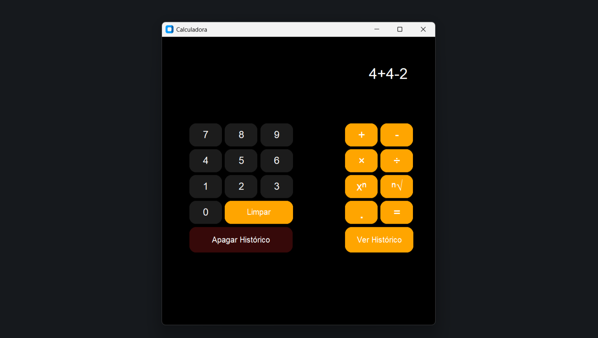
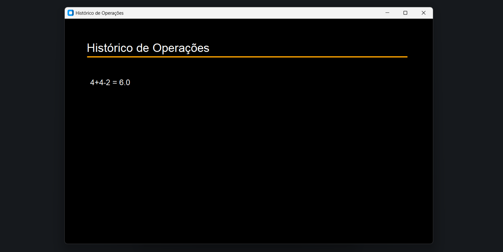
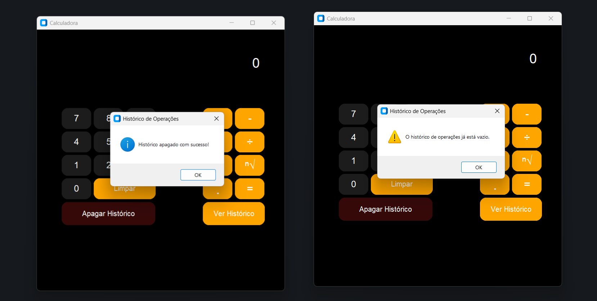

# 🧮 Calculadora Python com Histórico

Uma calculadora simples desenvolvida em Python, que utiliza uma arquitetura modular para realizar operações aritméticas fundamentais. A aplicação destaca-se por sua interface gráfica desenvolvida com a biblioteca **customtkinter**, pelo uso de manipulação de arquivos **JSON** e pela organização modular de seus pacotes.

---

## 📌 Funcionalidades

- **➕ Operações Matemáticas:** Soma, Subtração, Multiplicação (com múltiplos números), Divisão, Potenciação e Radiciação.

- **🗃️ Persistência de Dados:** Armazenamento automático de todas as operações realizadas em um arquivo .json.

- **📄 Gestão de Histórico:** Botões gráficos dedicados à visualização e limpeza do histórico de cálculos.

- **✅ Validação de operações:** Definição de expressão regular para validar a estrutura das operações, impedindo que cálculos inválidos sejam processados e quebre o sistema.

- **🎨 Interface Gráfica:** Interface moderna contendo botões de valores numéricos, operadores aritméticos, gestão de histórico e display de exibição de cálculos e resultados.

---

## 🛠️ Tecnologias Utilizadas

- **Linguagem:** Python 3

- **Persistência:** JSON (JavaScript Object Notation)

- **Módulos Internos:** `os`, `json`, `sys`, `re`, `customtkinter`

---

## 📁 Estrutura do Projeto

```bash
calculadora/
│
├── cfgcalculadora/
│   ├── __init__.py
│   ├── gerenciar_arquivos.py
│   ├── operacoes.py
│   ├── uteis.py
│   └── validacoes.py
│
├── historico/
│   └── operacoes_salvas.json
│
├── imagens/
│   ├── apagar_historico.png
│   ├── historico_operacoes.png
│   └── tela_principal.png
│
├── interface/
│   ├── __init__.py
│   ├── botoes_numeros.py
│   ├── botoes_operadores.py
│   ├── botoes_ponto_igual.py
│   ├── display_resultado.py
│   └── ver_apagar_historico.py
│
├── .gitignore
├── LICENSE
├── main.py
└── README.md
```

---

## 🚀 Como Executar

1. **Clone o repositório:**

```bash
git clone https://github.com/kauasantos-dev/calculadora.git
```

2. **Acesse a pasta do projeto:**

```bash
cd calculadora
```

3. **Execute a aplicação:**

```bash
python main.py
```

---

## 📝 Exemplo de Uso

### Tela principal

Ao executar o sistema, a interface gráfica será aberta em uma tela e a aplicação poderá ser utilizada.


### Histórico de Operações

O botão `Ver Histórico` cria uma nova tela que exibe todas as operações efetuadas pelo usuário.


### Apagar Histórico de Operações

O botão `Apagar Histórico` apaga todas as operações salvas no histórico e exibe **pop-ups** com mensagens informativas.


---

## 🧠 Aprendizados

O desenvolvimento deste projeto contribuiu para o **aprendizado** e **aprofundamento** de conceitos importantes, sendo eles:

### ✔️ Organização Modular

- Aprimorei a prática de estruturar projetos em **pacotes** e **módulos correspondentes as suas responsabilidades**.

### ✔️ Boas Práticas de Desenvolvimento

- Nomeei de forma clara e objetiva **variáveis, funções, módulos e pacotes** para **maior compreensão** e **simplicidade** do sistema.

- Evitei **repetição de código** criando **funções reutilizáveis**.

- Desenvolvi a aplicação utilizando conceitos de **fácil entendimento**, mantendo a **lógica simples**, **eficiente** e sem **complexidade desnecessária**.

### ✔️ Manipulação De Arquivos

- Aprofundei o conhecimento em **manipulação de arquivos** `.json` e persistência de dados.

- Implementei **caminhos absolutos** e **dinâmicos** utilizando a biblioteca `os` do python para garantir **maior compatibilidade** com **sistemas operacionais**.

---

## 🤝 Contribuição

Contribuições são bem-vindas! Sinta-se à vontade para abrir uma **issue** ou enviar um **pull request** para melhorar o projeto.

---

## ⚖️ Licença

Este programa está licenciado sob a **licença MIT**. Veja o arquivo `LICENSE` para mais detalhes.

---

## 👤 Autor

**Kauã Santos | Estudante de Análise e Desenvolvimento de Sistemas (ADS) - IFRN**  

**📞 Contato:**  

📧 **E-mail:** [kavillykaua@gmail.com](mailto:kavillykaua@gmail.com)  
💻 **GitHub:** [github.com/kauasantos-dev](https://github.com/kauasantos-dev)  
🌐 **LinkedIn:** [www.linkedin.com/in/kauasantos1](https://www.linkedin.com/in/kauasantos1)